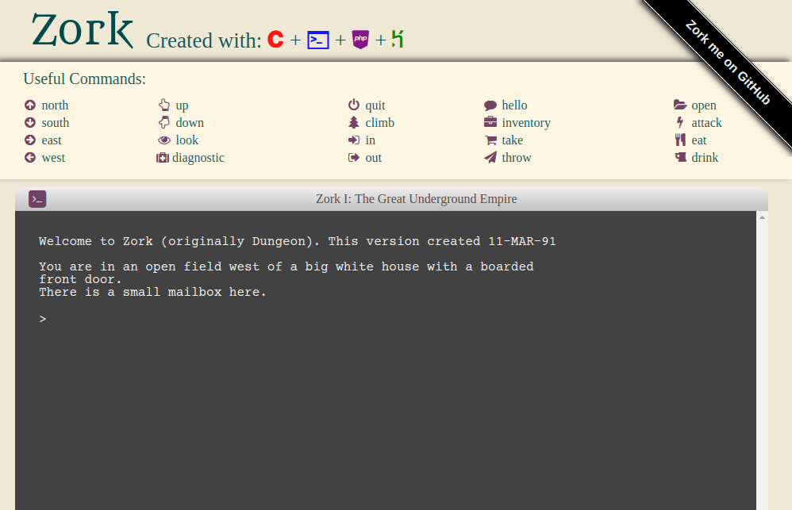

#Zork

http://zork.kumarcode.com/

##Compilation
The Zork program was compiled from C source code. To get the source code to
compile on my Linux distribution (Arch Linux), I edited the make file to compile
with the `Wall` flag.
##Future Plans
Would be nice to dynamically edit source code and compile server-side. This
would give the game a different feel and would allow me to add in memes. Not sure
if this is possible in Heroku. Example would be to replace the `kitchen` in the
abandoned building to a `combination pizza hut and taco bell.` 

